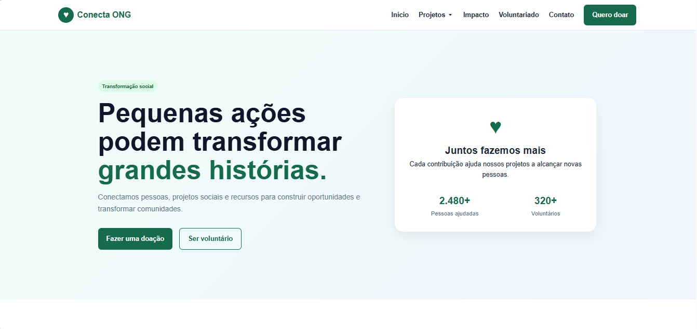

# Conecta ONG

Plataforma web desenvolvida para divulgação de projetos sociais, captação de doações e incentivo ao voluntariado.

## Sobre o projeto

A Conecta ONG é uma aplicação front-end responsiva criada com foco em acessibilidade, organização visual e experiência do usuário.

## Tecnologias utilizadas

- HTML5
- CSS3
- JavaScript
- CSS Grid
- Flexbox
- LocalStorage
- Design Responsivo

## Funcionalidades

- Menu responsivo
- Cards de projetos
- Formulário de voluntariado
- Validação de campos
- Modal de doação
- Toasts e alertas
- Badges
- Persistência de dados com LocalStorage
- Layout adaptado para diferentes tamanhos de tela

## Estrutura do projeto

```text
PROJETO-ONG/
├── css/
├── html/
├── imagens/
├── js/
├── README.md
└── .gitignore